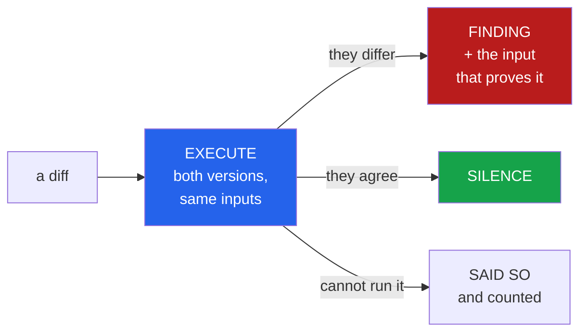

<h1 align="center">pr-referee (Python · ast · differential testing · mutation testing · Ollama)</h1>
<p align="center"><i>A code reviewer that only says what it can prove, and measures itself against one that guesses</i></p>

<p align="center">
  <a href="#the-through-line">The through-line</a> &middot;
  <a href="#the-result">The result</a> &middot;
  <a href="docs/METHOD.md">Method</a> &middot;
  <a href="#what-it-reports">What it reports</a> &middot;
  <a href="#run-it">Run it</a> &middot;
  <a href="#what-this-does-not-do">What it does NOT do</a> &middot;
  <a href="#problems-hit-while-building-this">Problems hit</a>
</p>

<p align="center">
  <a href="https://github.com/hammasbuilds/pr-referee/actions/workflows/ci.yml"></a>
  
  
  
  
  
  <a href="LICENSE"></a>
</p>

---

## The through-line



Every finding carries a reproduction — an input, a pair of values, a quoted construct — that
a reader can check in seconds without reading the diff. Nothing else is reported. No naming,
no structure, no "consider extracting this", no opinions.

The point is not that a model reviews badly. Measured here on the same diffs, one reviews
rather well — 94.7% precision. The point is what a reviewer is *for*.

A check that blocks a merge has to raise no false alarms, or it gets switched off within a
week. That is a much harder bar than being usually right, and it is the bar this tool is
built to clear: it would rather say nothing than say something a reader has to disprove.
The price is that it says nothing surprisingly often, and that number is published too.

> **A review comment you cannot check costs more than it saves.**

## The result

Precision is measured here, not asserted. Claiming "the findings are provable, therefore
precise" is circular — so both reviewers are run over the same labelled diffs and counted.

The labels come from two different places on purpose. **GOOD** cases are behaviour-preserving
*by construction* (rename a local, extract a return temporary, `x = x+1` → `x += 1`), so any
flag is a false positive. **BAD** cases are single-point mutations kept only when an
independent 240-wide input pool proves they differ — labelling with the same argument sets
the referee later receives would hand it perfect recall and measure nothing.

| reviewer | TP | FP | TN | FN | abstained | precision | recall | F1 |
|---|---:|---:|---:|---:|---:|---:|---:|---:|
| **pr-referee** | 22 | **0** | 45 | 0 | 49 | **100.0%** | 100.0% | 100.0% |
| `qwen2.5-coder:14b` | 18 | 1 | 91 | 6 | 0 | 94.7% | 75.0% | 83.7% |

116 labelled diffs from `toolz` &mdash; 24 proven to change behaviour, 92 equivalent by
construction. The referee decided 57.8% of them; the model decided all of them.

**Neither reviewer is simply better.** The referee never raised a false alarm and was
right about everything it decided, and it declined to decide 42% of the set. The model
had an opinion on every case, missed **1 real behaviour change in 4**, and raised one
false alarm.

That difference is what each is *for*. A gate that blocks a merge has to have no false
alarms, or it gets switched off; the referee can do that job and the model cannot. A
reviewer that covers everything has to be read by a person who can discount it; the model
can do that job and the referee cannot, because on 42% of these it has nothing to say.

**The model did far better here than the 44.8% precision measured in
[code-llm-lab](https://github.com/hammasbuilds/code-llm-lab).** That is not a
contradiction, it is the most interesting number in the table. Project 08 asked *"is there
a bug in this function?"* and showed one version. This asks *"did this diff change
behaviour?"* and shows both. Handing the model the before and the after turns a judgement
call into a comparison, and it is good at comparisons. Anyone building an LLM review step
should be posing it the second question.

The referee also raised **35 structural findings** &mdash; swallowed errors, widened
catches, removed branches. Those are not claims about behaviour differing on an input, so
they are not scored above.

See [docs/RESULTS.md](docs/RESULTS.md) for the full run and [docs/METHOD.md](docs/METHOD.md)
for how the labels are built.

## What it reports

Five things, and nothing else. Each is a fact about the change, not a judgement of it.

| kind | what it means | the evidence |
|---|---|---|
| `behaviour-change` | old and new return different things | the argument set, and both results |
| `swallowed-error` | an exception path that used to propagate no longer does | the handler, quoted |
| `widened-catch` | an `except` clause now catches strictly more | before and after breadth |
| `removed-branch` | a conditional test present before is gone | the `if` test, quoted |
| `weakened-tests` | the change made the function harder to tell from a broken version of itself | mutants distinguished, before and after |

Only the first is a claim about behaviour on an input. The other four exist because there is
a class of problem execution cannot reach: a swallowed exception shows up only on an input
that triggers it, and the argument sets often will not.

Real output, from narrowing `toolz`'s `get_in` to a bare `except Exception: return default`:

```
  [behaviour-change] toolz/dicttoolz.py::get_in
    this change alters what the function returns
    | get_in([1, 2, 3], [1, 2, 3], 'b', True)
    |   before: raise: TypeError: 'int' object is not subscriptable
    |   after:  ok: 'b'
    -> 24 of 30 inputs disagree

  [widened-catch] toolz/dicttoolz.py::get_in
    the exception clause widened to `Exception`
    | broadest handler before: level 1; after: level 2
    -> A broader clause also catches the errors nobody meant to handle.

  [removed-branch] toolz/dicttoolz.py::get_in
    1 conditional path(s) no longer present
    | `if no_default`
    -> Whatever the removed branch did is now unreachable.
```

One change, three independent facts about it — and `get_in([1, 2, 3], [1, 2, 3], 'b', True)`
is checkable in a REPL in ten seconds.

### Silence means something specific

When nothing is found, the tool says *"nothing here could be proven wrong"* — not *"looks
good to me"*. Those are different claims and conflating them is how a green tick becomes
meaningless.

And when a function cannot be executed at all — it needs an object the harness cannot build,
or a dependency that is not installed — that is **counted and reported**. A reviewer that
quietly skips what it cannot handle looks more thorough than it is, and the gap is exactly
where a real problem would sit.

## Run it

```bash
git clone https://github.com/hammasbuilds/pr-referee
cd pr-referee
uv venv && uv pip install -e ".[dev]"

# review a branch
pr-referee review /path/to/repo --base main --head HEAD

# in CI, fail the build on a provable finding
pr-referee review . --base origin/main --head HEAD --fail-on-finding

# score the referee against a model on labelled diffs
pr-referee bench /path/to/repo --limit 140
```

`review` needs no model at all — it is pure execution. Only `bench`'s comparison arm needs
Ollama with `qwen2.5-coder:14b`.

The target repo's own dependencies must be importable: a function whose module imports
`httpx` cannot be loaded, and therefore cannot be verified, without it.

## Layout

```
src/pr_referee/
  extract.py        both versions of every changed function, from two git revisions
  values.py         argument sets: harvested from the repo's tests, typed, and corners
  engine/
    differential.py run both versions, compare results AND exceptions
    mutation.py     how distinguishable a function is from a broken version of itself
  checks/statics.py swallowed errors, widened catches, removed branches
  referee.py        run every check, count what could not be executed
  reviewer.py       the model arm, for comparison only
  bench.py          labelled diffs: equivalent by construction, or provably different
  score.py          precision, recall, and abstentions kept separate
```

## Stack

`Python 3.11+` &middot; `ast` (stdlib) &middot; `subprocess` (stdlib) &middot;
`urllib` (stdlib) &middot; `qwen2.5-coder:14b` via `Ollama` &middot; `pytest` &middot;
`ruff` &middot; `GitHub Actions`

**Zero runtime dependencies**, and no orchestration framework. A tool whose claim is *"every
finding is reproducible"* should not ask you to trust a dependency tree in order to believe
it. The review path is a loop over functions with an early exit — a graph library would add
indirection and nothing else, and the hard part is the execution, which no framework helps
with.

## What this does NOT do

- **It does not review methods.** A method needs an instance, and constructing one means
  running the code under review. Module-level functions only.
- **It does not prove universal equivalence.** It proves agreement on the inputs it tried.
  Those include the known corners, but "checked" is a weaker and more honest claim than
  "safe".
- **It says nothing about style.** Naming, structure, length, whether an abstraction is the
  right one — all real, none provable, none here. This complements a human reviewer rather
  than replacing one.
- **It abstains often.** That is reported as a number, not hidden. A function it cannot call
  is a function it has no opinion about.
- **One repo, one benchmark.** The comparison below is a measurement on a set this repo
  builds, not a general claim about code review.

## Problems hit while building this

- **The benchmark could invent false positives.** `free_names` only collects names that are
  *read*, so a function already assigning `_result` passed the collision guard and had that
  variable clobbered by the "behaviour-preserving" transform — producing a GOOD case that
  does not preserve behaviour, and charging a false positive to whichever reviewer correctly
  noticed. Caught by a test written for exactly that.
- **The comparison was unfair to the model.** Every case had its "new" side reformatted by
  `ast.unparse` while the "old" side was original source, so every diff carried a wall of
  cosmetic noise. That noise fell on both labels equally so it did not bias the direction —
  but it handed the model a harder problem than the one being asked about. Both sides are
  now round-tripped, so the only difference is the change.
- **Five engine bugs were inherited rather than rediscovered.** Namespace isolation for
  recursion, a shared `__name__` so class reprs match, address normalisation, unevaluated
  annotations, and package context — each one was a *confident wrong answer* found while
  building [repo-surgeon](https://github.com/hammasbuilds/repo-surgeon), and each is pinned
  by a test here.

## Also worth reading

| | |
|---|---|
| &#128269; **[Method](docs/METHOD.md)** | How findings are produced and what each may claim |
| &#128202; **[Results](docs/RESULTS.md)** | The full benchmark run |
| **[repo-surgeon](https://github.com/hammasbuilds/repo-surgeon)** | The same engine, pointed the other way: it *proposes* changes and refuses what it cannot prove |
| **[code-llm-lab](https://github.com/hammasbuilds/code-llm-lab)** | Where the 44.8% precision figure comes from |

## Keywords

code review &middot; automated code review &middot; differential testing &middot; mutation
testing &middot; regression detection &middot; AST &middot; equivalence checking &middot;
CI &middot; pull request automation &middot; LLM code review &middot; local LLM &middot;
Ollama &middot; qwen2.5-coder &middot; precision and recall &middot; reproducible findings

## License

MIT - see [LICENSE](LICENSE).
